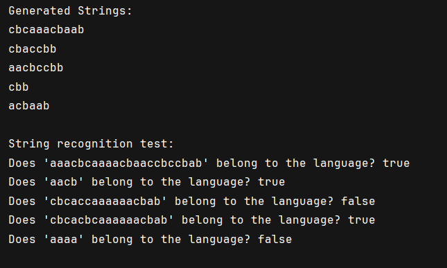

#  Intro to formal languages. Regular grammars. Finite Automata.

### Course: Formal Languages & Finite Automata
### Author: Vornicescu Ion 

----

## Theory
Formal languages are collections of strings built from an alphabet and defined by precise rules, used in linguistics, programming, and automata theory. A regular grammar is a special type of formal grammar that generates regular languages and can be expressed using simple production rules, either left-linear or right-linear. Finite automata are mathematical models used to recognize regular languages, consisting of a finite number of states, transitions between them, and a transition function. These concepts are fundamental in computability theory and compiler design.

## Objectives:

* Discover what a language is and what it needs to have in order to be considered a formal one;
* Provide the initial setup for the evolving project that I will work on during this semester.
* Implement a type/class for my grammar;
* Add one function that would generate 5 valid strings from the language expressed by my given grammar;
* Implement some functionality that would convert and object of type Grammar to one of type Finite Automaton;
* For the Finite Automaton, please add a method that checks if an input string can be obtained via the state transition from it;


## Implementation description

```
 public String generateString() {
        Random random = new Random();
        String current = startSymbol;

        while (!current.chars().allMatch(c -> VT.contains((char) c))) {
            StringBuilder next = new StringBuilder();
            for (char c : current.toCharArray()) {
                String symbol = String.valueOf(c);
                if (VN.contains(symbol) && P.containsKey(symbol)) {
                    List<String> productions = P.get(symbol);
                    next.append(productions.get(random.nextInt(productions.size())));
                } else {
                    next.append(symbol);
                }
            }
            current = next.toString();
        }
        return current;
    }
```
This is the method of the Grammar class that generates a random string based on a context-free grammar. It starts with the startSymbol and repeatedly replaces non-terminal symbols (VN) using production rules (P) until only terminal symbols (VT) remain. The result is a randomly generated string derived from the grammar.

```
public boolean stringBelongToLanguage(String input) {
        String currentState = q0;
        for (char c : input.toCharArray()) {
            if (delta.containsKey(currentState) && delta.get(currentState).containsKey(c)) {
                currentState = delta.get(currentState).get(c);
            } else {
                return false;
            }
        }
        return F.contains(currentState);
    }
```
This is the method of the FiniteAutomaton class that checks whether a given string belongs to the language recognized by a finite automaton. It starts from the initial state (q0) and processes each character of the input using the transition function (delta). If the final state after processing belongs to the set of accepting states (F), the method returns true; otherwise, it returns false.
```
private final Set<String> Q = new HashSet<>(Arrays.asList("S", "D", "R")); // Set of states
    private final Set<Character> Sigma = new HashSet<>(Arrays.asList('a', 'b', 'c')); // Input alphabet
    private final Map<String, Map<Character, String>> delta = new HashMap<>(); // Transition function
    private final String q0 = "S"; // Initial state
    private final Set<String> F = new HashSet<>(Collections.singletonList("R")); // Final states

    public FiniteAutomaton() {
        delta.put("S", Map.of('a', "S", 'c', "D"));
        delta.put("D", Map.of('b', "R"));
        delta.put("R", Map.of('a', "R", 'b', "R", 'c', "S"));
    }
```
This is the constructor of the FiniteAutomaton class, which defines a deterministic finite automaton (DFA). It initializes the set of states (Q), input alphabet (Sigma), transition function (delta), initial state (q0), and final states (F). The transition function (delta) specifies how the automaton moves between states based on input characters.

## Results


## Conclusions

In this lab, we explored the foundational concepts of formal languages, regular grammars, and finite automata. We implemented a Grammar class that generates random strings based on a context-free grammar and a FiniteAutomaton class that checks whether a string belongs to the language recognized by the automaton. By translating a grammar into a finite automaton, we bridged the gap between formal language theory and practical automata recognition. This work deepens our understanding of computational theory, laying a solid groundwork for more complex tasks in areas like compiler design and language processing.

## References
* Finite State Machine (Finite Automata)  
* https://www.youtube.com/watch?v=Qa6csfkK7_I
* LFPC Guide