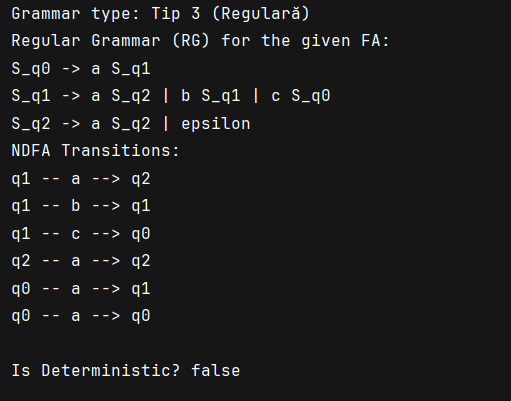
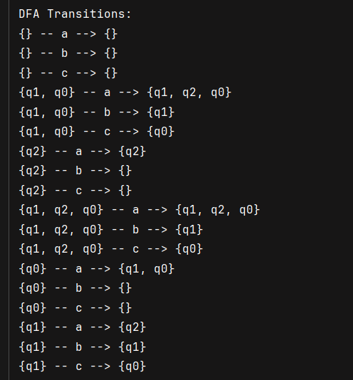
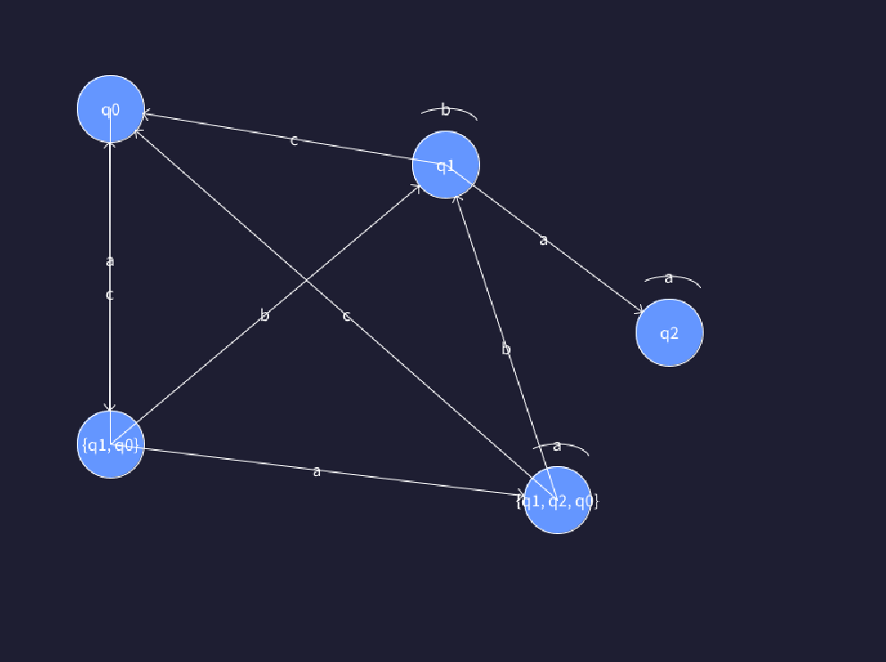

#  Determinism in Finite Automata. Conversion from NDFA 2 DFA. Chomsky Hierarchy.

### Course: Formal Languages & Finite Automata
### Author: Vornicescu Ion

----

## Theory
Determinism in Finite Automata (FA) refers to a type of automaton where, for each state and input symbol, there is exactly one transition to a subsequent state. This contrasts with nondeterministic finite automata (NDFA), where there may be multiple possible transitions for the same input symbol and state. In a DFA, the transition function is deterministic, meaning there are no ambiguities in determining the next state. The ability to have a unique transition for every input symbol and state makes DFAs easier to implement and analyze, especially for practical applications like lexical analysis in compilers. Conversely, an NDFA can have multiple possible transitions for the same state and input symbol or even no transition at all. Despite this, both DFAs and NDFAs recognize the same class of languages, known as regular languages. However, converting a nondeterministic finite automaton (NDFA) into a deterministic finite automaton (DFA) is an essential process in formal language theory and automata theory, as DFAs are more practical for implementation in computational models. The conversion from NDFA to DFA can be accomplished using the powerset construction method (or subset construction). In this process, the set of all possible states in the NDFA is used to form the states of the DFA. Each DFA state represents a subset of NDFA states, and the transitions between DFA states are determined by considering all possible transitions of the corresponding NDFA states under a given input symbol. The initial state of the DFA is the set of states reachable from the NDFA’s initial state. The DFA’s final states are any states that contain an NDFA final state. Although the DFA may have exponentially more states than the NDFA, this conversion guarantees that the DFA recognizes the same language as the NDFA.

The Chomsky Hierarchy is a classification scheme for formal languages that organizes them based on the complexity of the automata or computational models that recognize them. It consists of four types: Type 0, Type 1, Type 2, and Type 3. Type 0, also known as recursively enumerable languages, is the most general and can be recognized by a Turing machine, which has unbounded computational power. Type 1 languages, or context-sensitive languages, require a linear-bounded automaton (LBA), which has restricted memory usage compared to a Turing machine. Type 2 languages, or context-free languages, are those that can be recognized by a pushdown automaton (PDA) that uses a stack as its memory structure. These languages are significant in parsing and syntax analysis for programming languages. Finally, Type 3 languages, or regular languages, can be recognized by finite automata, including both deterministic (DFA) and nondeterministic (NDFA) versions. Regular languages are the simplest and can be described by regular expressions. The Chomsky Hierarchy reflects increasing computational complexity, from the most general Type 0 languages to the simplest regular languages, and provides insight into the capabilities and limitations of different computational models. The distinction between these language types is crucial in the theory of computation and has practical implications in fields like compiler design, natural language processing, and automata-based computations.
## Objectives:

* Understand what an automaton is and what it can be used for.
* Provide a function in your grammar type/class that could classify the grammar based on Chomsky hierarchy.
* Implement conversion of a finite automaton to a regular grammar.
*  Determine whether your FA is deterministic or non-deterministic.
* Implement some functionality that would convert an NDFA to a DFA.
*  Represent the finite automaton graphically

## Implementation description

```java
public String determineGrammarType() {
        boolean isRegular = true;
        boolean isContextFree = true;
        boolean isContextSensitive = true;

        for (Map.Entry<String, List<String>> entry : RULES.entrySet()) {
            String leftSide = entry.getKey();
            List<String> rightSides = entry.getValue();

            for (String rightSide : rightSides) {
                // Verificare Tip 2 (CFG): Stânga trebuie să fie un singur neterminal
                if (!VN.contains(leftSide) || leftSide.length() != 1) {
                    isContextFree = false;
                }

                // Verificare Tip 3 (Regulară): Forma trebuie să fie A → xB sau A → x
                if (rightSide.length() > 2) {
                    isRegular = false;
                } else if (rightSide.length() == 2) {
                    char firstChar = rightSide.charAt(0);
                    char secondChar = rightSide.charAt(1);
                    if (!VT.contains(String.valueOf(firstChar)) || !VN.contains(String.valueOf(secondChar))) {
                        isRegular = false;
                    }
                } else if (rightSide.length() == 1) {
                    if (!VT.contains(rightSide)) {
                        isRegular = false;
                    }
                }

                // Verificare Tip 1 (CSG): Lungimea părții drepte trebuie să fie ≥ lungimea părții stângi
                if (rightSide.length() < leftSide.length()) {
                    isContextSensitive = false;
                }
            }
        }

        // Returnează cel mai specific tip de gramatică detectat
        if (isRegular) return "Tip 3 (Regulară)";
        if (isContextFree) return "Tip 2 (Indep. de context - CFG)";
        if (isContextSensitive) return "Tip 1 (Dep. de context - CSG)";
        return "Tip 0 (Recursiv enumerabilă)";
    }
```
The determineGrammarType() function analyzes a set of grammar rules and classifies the grammar into one of four types based on the Chomsky Hierarchy: Regular (Type 3), Context-Free (Type 2), Context-Sensitive (Type 1), or Recursively Enumerable (Type 0). It checks for specific conditions for each type, such as the form of the rules and the length of the left and right sides of the production. The function returns the most specific type that matches the grammar rules, starting from Regular and moving up to Recursively Enumerable if none of the more specific conditions are met.
```java
Set<Set<String>> dfaStates = new HashSet<>();
Queue<Set<String>> queue = new LinkedList<>();
Map<Set<String>, String> stateNames = new HashMap<>();

Set<String> startSet = epsilonClosure(Set.of(startState));
dfaStates.add(startSet);
queue.add(startSet);
stateNames.put(startSet, setToString(startSet));

Map<String, Map<Character, String>> dfaTransitions = new HashMap<>();

```
Here, dfaStates stores all DFA states, which are represented as sets of NFA states. A queue, queue, is used for processing each newly discovered state. The stateNames map assigns a unique name to each DFA state (which is actually a set of NFA states). The startSet is initialized as the ε-closure of the start state, meaning all states reachable from the initial state via epsilon transitions. This set is then added to the DFA state list and queued for processing. The dfaTransitions map will later store the transitions between DFA states.


```java
while (!queue.isEmpty()) {
    Set<String> currentState = queue.poll();
    String currentStateName = stateNames.get(currentState);
    dfaTransitions.putIfAbsent(currentStateName, new HashMap<>());

    for (char symbol : alphabet) {
        Set<String> newState = new HashSet<>();
        for (String state : currentState) {
            if (transitions.containsKey(state) && transitions.get(state).containsKey(symbol)) {
                newState.addAll(transitions.get(state).get(symbol));
            }
        }
        newState = epsilonClosure(newState);

        if (!dfaStates.contains(newState)) {
            dfaStates.add(newState);
            queue.add(newState);
            stateNames.put(newState, setToString(newState));
        }
        String newStateName = stateNames.get(newState);
        dfaTransitions.get(currentStateName).put(symbol, newStateName);
    }
}

```
The loop continues as long as there are unprocessed states in the queue. Each state is dequeued and its corresponding name is retrieved. The algorithm then iterates over each symbol in the alphabet.

For each symbol, it finds all possible transitions from the current set of NFA states. It does this by checking each state in currentState and collecting all states that can be reached through the current symbol. Then, it applies the ε-closure function to include any states reachable through epsilon transitions.

If the newly generated state set has not been seen before, it is added to dfaStates, queued for processing, and assigned a unique name. Finally, a transition is recorded in dfaTransitions, linking the current DFA state to the new state.


```java
// Create the set of final states for the DFA
Set<String> dfaFinalStates = new HashSet<>();
for (Set<String> state : dfaStates) {
    for (String s : state) {
        if (finalStates.contains(s)) {
            dfaFinalStates.add(stateNames.get(state));
            break;
        }
    }
}

// Create the new DFA
FiniteAutomaton dfa = new FiniteAutomaton(new HashSet<>(stateNames.values()), alphabet, setToString(startSet), dfaFinalStates);

// Add the transitions to the new DFA
for (String state : dfaTransitions.keySet()) {
    for (char symbol : dfaTransitions.get(state).keySet()) {
        dfa.addTransition(state, symbol, dfaTransitions.get(state).get(symbol));
    }
}

return dfa;

```
The convertToDFA() function converts a given Nondeterministic Finite Automaton (NDFA) to a Deterministic Finite Automaton (DFA). It does this by using the powerset construction method, where the states of the DFA are represented as sets of NDFA states. The process starts by calculating the epsilon-closure of the NDFA's start state, then iteratively explores all possible transitions for each state set. For each state set and input symbol, it computes the new state and adds it to the DFA if it hasn't been encountered before. The function also handles the creation of transitions between states and final states for the DFA. The result is a DFA with a defined set of states, transitions, and final states, which recognizes the same language as the NDFA.

```java
public boolean isDeterministic() {
        for (Map<Character, Set<String>> stateTransitions : transitions.values()) {
            for (Set<String> destinations : stateTransitions.values()) {
                if (destinations.size() > 1) {
                    return false;
                }
            }
        }
        return true;
    }
```
The isDeterministic() function checks whether a finite automaton (FA) is deterministic. It iterates through the transitions of each state and verifies that, for every input symbol, there is at most one possible destination state. If it finds any input symbol that leads to multiple destination states (i.e., a set of destinations with more than one element), the function returns false, indicating the automaton is nondeterministic. If no such case is found, the function returns true, confirming that the automaton is deterministic.

```java
public static void generateRegularGrammar() {
        
        for (State state : State.values()) {
               StringBuilder productionRule = new StringBuilder("S_" + state.name() + " -> ");

                        boolean firstTransition = true; // To handle the "|" separator

            for (Map.Entry<Character, State> transition : transitionFunction.get(state).entrySet()) {
                char symbol = transition.getKey();
                State nextState = transition.getValue();

                                if (!firstTransition) {
                    productionRule.append(" | ");
                }
                firstTransition = false;

                
                productionRule.append(symbol + " S_" + nextState.name());
            }

            if (state == State.q2) {
                productionRule.append(" | epsilon");
            }

            System.out.println(productionRule);
        }
    }
```
The generateRegularGrammar() function generates a regular grammar based on the transitions of a finite automaton. It iterates through all the states of the automaton and constructs production rules in the form of a grammar. For each state, the function creates a rule that specifies how that state can transition to another state based on an input symbol. The production rules are printed in the form S_<state> -> symbol S_<nextState>, where <state> is the current state and <nextState> is the state reached by the input symbol.

For each transition in the state, the function appends the corresponding symbol and the next state in the format described above. It also handles the | separator between multiple possible transitions. Additionally, if the state is a final state (in this case, State.q2), it appends epsilon to the production rule, representing the possibility of the automaton accepting the string without consuming any more symbols.
## Results






## Conclusions

In conclusion, this lab work focused on understanding and implementing key concepts related to finite automata and formal grammars. Through the tasks, we explored the process of converting a nondeterministic finite automaton (NDFA) to a deterministic finite automaton (DFA), ensuring that we adhered to the determinism conditions of finite automata. Additionally, we examined the creation of regular grammar from a finite automaton, generating production rules to represent the same language in a formal grammar. By implementing and testing the core concepts such as epsilon closures, state transitions, and regular grammar generation, this lab provided practical experience in automata theory and its application to formal language processing. The skills gained here are foundational to understanding more complex computational models and are essential for further exploration into formal languages, compilers, and automata-based algorithms.
## References
* Finite State Machine (Finite Automata)
* https://www.youtube.com/watch?v=Qa6csfkK7_I
* LFPC Guide